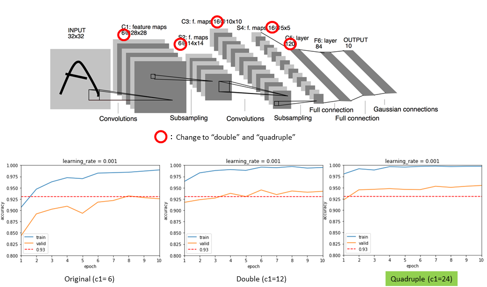

# Traffic Sign Classification
Build a Traffic Sign Recognition Project
The goals / steps of this project are the following:
* Load the data set (see below for links to the project data set)
* Explore, summarize and visualize the data set
* Design, train and test a model architecture
* Use the model to make predictions on new images
* Analyze the softmax probabilities of the new images
* Summarize the results with a written report

### First of All
Please refer to this file for the file described in this document  
jpynb:[(./Traffic_Sign_Classifier.ipynb)](./Traffic_Sign_Classifier.ipynb) 
html:[(./Traffic_Sign_Classifier.html)](./Traffic_Sign_Classifier.html) 

# 1. Data Set Summary & Exploration
Used Traffic sign images : [German Traffic Sign Dataset](http://benchmark.ini.rub.de/?section=gtsrb&subsection=dataset)
* The size of training set : 34799
* The size of the validation set : 4410
* The size of test set : 12630
* The shape of a traffic sign image : (32, 32, 3)
* The number of unique classes/labels in the data set : 43  

 
 
43 kinds of signs randomly picked up from the dataset
#### Notes on data samples
There is uneven data in the following
1. Number of data samples (refer the histogram)
2. Size, center position, angle(the sign rotates), view angle(view is not front)
3. Image brightness, saturation and contrast

# 2. Design and Test a Model Architecture
## 2-1 Preprocessing
#### Counter Measures the above "Notes on data samples"
I did the following image processing to take measures against the above three items.
1. Create padding data (add 2 below)
2. Change the original image  
    *Resizing  
    *Center position shift  
    *Rotation  
    *perspective transform  
3. Gray scaling & Normalizing

## 2-2 Model Architecture
#### LeNet
The model is based on [LeNet](http://yann.lecun.com/exdb/lenet/) by Yann LeCun.

 
  
Base model by Yann LeCun  

I improved the base models and my final model consisted of the following layers:  

|Layer                       | Description |
|----------------------------|:--------:|
|Input                       | 32x32x1  |
|Convolution (valid, 5x5x24) | 28x28x24 |
|Max Pooling (valid, 2x2)    | 14x14x24 |
|Activation  (ReLU)          | 14x14x24 |
|Convolution (valid, 5x5x64) | 10x10x64 |
|Max Pooling (valid, 2x2)    | 5x5x64   |
|Activation  (ReLU)          | 5x5x64   |
|Flatten                     | 1600     |
|Dense                       | 480      |
|Activation  (ReLU)          | 480      |
|Dense                       | 168      |
|Activation  (ReLU)          | 168      |
|Dense                       | 43       |
|Activation  (Softmax)       | 43       |
## 2-3 Model Training
Hyperparameters are:  

| Name            | Value  | Description                                                 |
|:---------------:|:------:|:-----------------------------------------------------------:|
| `mu`            | 0      | For initilazing Weights with normal distribution            |
| `sigma`         | 0.1    | For initilazing Weights with normal distribution            |
| `learning_rate` | 0.001* | For training neural network (change to 0.0005 on try model) |
| `BATCH_SIZE`    | 256    | Number of images feeding to the model at one time           |
| `epoch`         | 20*    | Number of times for training (change to 10 on try model)    |
## 2-4 Solution Approach
### 2-4-1. Change parameter all filters in the convolutional layers and neurons in the dense layers
 
I adopted the quadruple model because the accuracy rate increases as the number of parameters increases.  
### 2-4-2. Change learning rate
 
"0.001" model is the most stable.
### 2-4-3. Change epoch
 
The epoch 10 model seems to be more stable, but if you look at the graph of the epoch 20 model, you can see that the epoch 7th, 12th, and 18th are going up and down.  
I finally adopted the Epoch 20 model because it seems that the learning rate will eventually converge to 0.95.  
In this case, however, the learning rate is stable around 0.95, so I think there is no problem with Epoch 10.   
### 2-4-4.Result 
Cleared all target accuracy rates of 0.93
- Validation Accuracy by train data = 0.996
- Validation Accuracy by valid data = 0.951
- Validation Accuracy by test data = 0.952
# 3. Test a Model on New Images
## 3-1 preparing a new 10 image
The model was verified by preparing a new 10 image that has never been tested.
Using 10 images found arbitrarily from the web.
 
Reasons for selecting signs:

| label No.    | External shape| Description                                                 |
|:------------:|:-------------:|:-----------------------------------------------------------:|
| 27, 30, 28   | triangle      | To check if the picture inside the triangular shape can be recognized correctly. Especially in No.30 and No.28, it is difficult to discriminate if the resolution is rough, so it may not be recognized correctly by the training model.|
| 5, 7, 1,     | circle, Number  | To check if the picture inside the circle shape can be recognized correctly. Especially in No.5 "30" and No.1 "80", it is difficult to discriminate if the resolution is rough, so it may not be recognized correctly by the training model.|
| 12, 9, 35, 14 | polygon, symbol, color | To make sure that the outline, symbols, and colors are recognized correctly or that they are versatile.|
## 3-2 Prediction result
This is captured images in my output result in jupyter notebook
 
## 3-3 Top5 predinction results
 
Prediction of 30. "Beware of ice / snow"  were off.
The No1 prediction is a similar triangular 23.Slippery road.
As expected, it was possible to discriminate up to the outer triangle, but it seems that the picture inside was wrong. Strangely, the meaning of the sign is similar (in the sense of snow and freezing), but this result seems to be completely unrelated.
